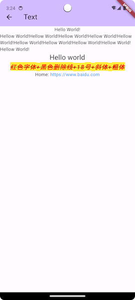
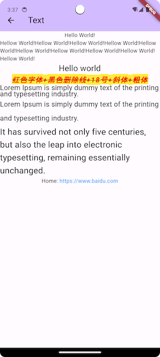

# Text

参考：

+ [文本及样式](https://book.flutterchina.club/chapter3/text.html#_3-1-1-text)


## TextStyle

设置Text的颜色、字体、粗细、背景，要使用TextStyle

如下的例子：

```dart
          Text(
            "红色字体+黑色删除线+18号+斜体+粗体",
            style: TextStyle(
                color: const Color(0xffff0000),
                background: Paint()..color = Colors.yellow,
                // 删除线
                decoration: TextDecoration.lineThrough,
                // 删除线颜色
                decorationColor: const Color(0xff000000),
                // 字体大小
                fontSize: 18.0,
                // 斜体
                fontStyle: FontStyle.italic,
                // 字体粗细
                fontWeight: FontWeight.bold,
                // 文字间距
                letterSpacing: 2.0),
          ),
```

显示效果如下：




通过`height`来设置行间距，如：

```dart
          Text(
            "Lorem Ipsum is simply dummy text of the printing and typesetting industry.",
            style: TextStyle(
              fontSize: 18,
              height: 0.9, // 1= 100%, were 0.9 = 90% of actual line height
            ),
          ),
          Text(
            "Lorem Ipsum is simply dummy text of the printing and typesetting industry.",
            style: TextStyle(
              fontSize: 18,
              height: 2.0, // 1= 100%, were 0.9 = 90% of actual line height
            ),
          ),
          Text(
            "It has survived not only five centuries, but also the leap into electronic typesetting, remaining essentially unchanged. ",
            style: TextStyle(
              fontSize: 22,
              height: 1.5, //150% of actual height
            ),
          ),
```




## TextSpan

富文本，可通过`TextSpan`来显示，如：

```dart
          Text.rich(TextSpan(
            children: [
              TextSpan(text: "Home: "),
              TextSpan(
                text: "https://www.baidu.com",
                style: TextStyle(color: Colors.blue),
                recognizer: TapGestureRecognizer()
                  ..onTap = () {
                    print("Tap");
                  },
              )
            ],
          )),
```


